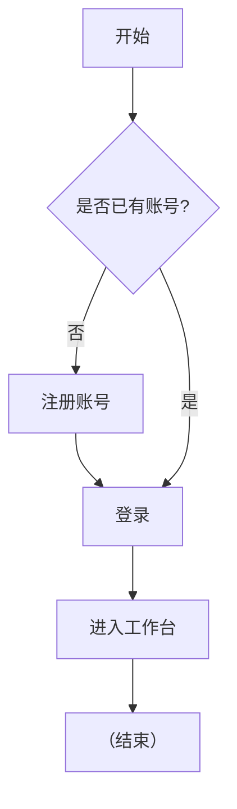
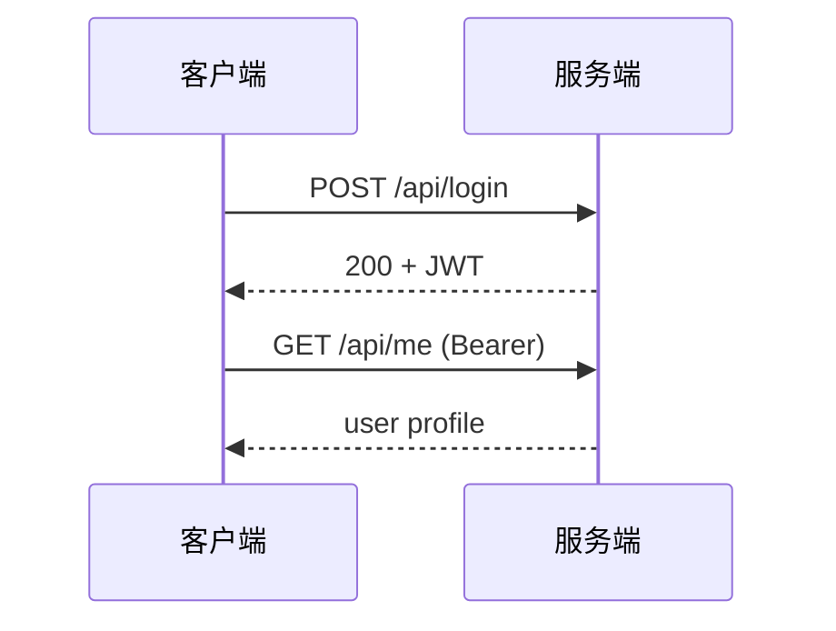

# 功能验证

本文将构造一个包含 Mermaid 流程图、KaTeX 数学公式与代码块的页面，用于验证三项集成是否生效。

## Mermaid 流程图



## KaTeX 数学公式

行内公式：欧拉恒等式 $e^{i\pi} + 1 = 0$。

独立公式：

$$
\sum_{n=1}^{\infty} \frac{1}{n^2} = \frac{\pi^2}{6}
$$

## 时序图



## 矩阵

$$
\begin{pmatrix} a & b \\ c & d \end{pmatrix}
^{-1} = \frac{1}{ad - bc}
\begin{pmatrix} d & -b \\ -c & a \end{pmatrix}
$$

## 代码块

```ts
interface Parser {
  parse(source: string): AST;
}

const p: Parser = {
  parse(src) {
    return { src };
  },
};
```

## Bash

```bash
# 安装依赖
bun install --frozen-lockfile
```

## 总结

- ✅ `mermaid` 前端运行时渲染流程图与时序图为内联 SVG
- ✅ `remark-math` + `rehype-katex` 渲染行内/块级公式
- ✅ 每个代码块右上角带「复制」按钮
